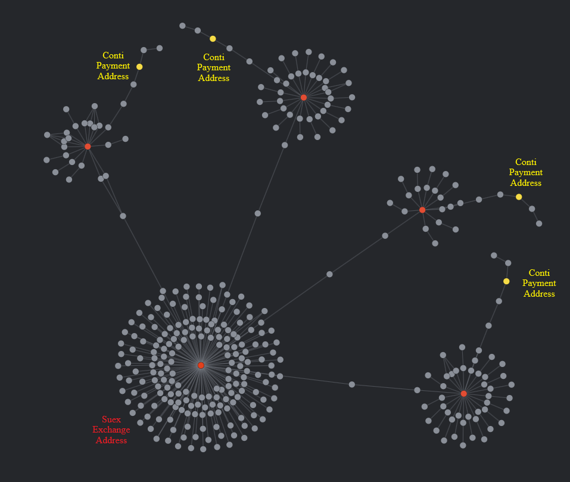
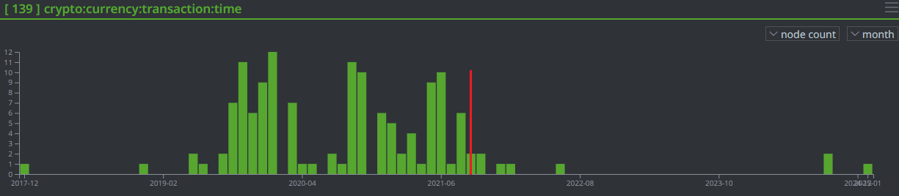
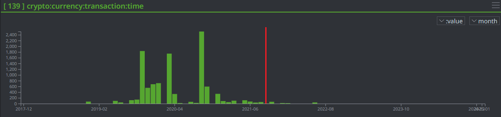

# SEST-6650: Hands-On Open Source Intelligence Capstone Project

This repository contains the code, some data, and my report for SEST-6650 (Georgetown University Security Studies Program).

I tried to examine the Bitcoin transaction volume and frequency of addresses involved in ransomware activity. I looked [addresses sanctioned by OFAC](https://sanctionslist.ofac.treas.gov/Home/SdnList) and ransomware payment addresses publicly reported to [the Ransomwhere dataset](https://ransomwhe.re/#download).

I used [Synapse](https://vertex.link/synapse) for... almost everything. Synapse is great. It's fantastic. To be honest, I think if you were trying to do what I was doing, for at a real scale and not as a grad student project, you might want to use a different graph database (since Synapse is a "Central Intelligence System" with an excellent graph, but it's not exactly the same use case as Neo4j) and then model your results in or connect to Synapse. For my purposes, though, it was effective. I did destroy my demo instance after hitting around half a million nodes and had to ask Vertex to rescue me, which they graciously did.

Anyways, Synapse made it incredibly easy to create things like this:

_Force Graph Showing Conti Payments to the Suex Exchange_

_Bar Graph Showing Number Of Payments to Conti Addresses Dropping After Suex Sanctions_

_Bar Graph Showing Volume of Bitcoin to Conti Addresses Dropping After Suex Sanctions_

The part of the project that was hard was the graph traversal from the set of ransomware nodes to the set of sanctioned nodes. I basically ran breadth-first search from each set of nodes, marking the distance and the previous node as I expanded outwards.

While this did work, and it enabled me to run it, walk away, come back later and do some Storm (Synapse's query language) queries to identify paths when the two BFS' converged, it's a pretty janky implementation. There are a few reasons for this.
1. I am not a Storm dev. Storm is cool. I like that this query language is capable of making graph edits and that you can script with it. But there were times where the pipelining and parallelism present in Storm made this harder to write. (To be fair, it's probably also the only reason that my code finished executing before the heat death of the universe)
2. It... had a race condition? Non-determinism? I'm not even sure. I suspect that my understanding of Synapse's parallelism was incomplete, and that I introduced some non-obvious bugs in my code.

So, yeah, the BFS designed to find paths was rough. It did work, and I found that Conti addresses usually ended up sending their ransom money to Suex addresses. But when payments got sent to major exchanges or to addresses used by a lot of ransomware families, or to addresses with just huge transaction frequency, things started to get unstable. I also only had so much space on my Synapse demo instance and only so much time to work on this between work and classes.

Other than that, the big gap in visibility here is the whole _waves hands_ cybercrime ecosystem thing. I can't really state one way or another (based on this research) whether or not ransomware operators or the exchange/mixer infrastructure just renamed themselves to avoid sanctions, switched up some things to avoid signatures, etc. Also, I have no idea how good the breakdown of ransomware families/actors present in Ransomwhere is. Attribution is a thing and cybercrime is messy. I suspect datasets drawn from sources like Mandiant, Crowdstrike, Microsoft, FBI, might be more reliable, but those aren't going to be publicly accessible.

So yeah. I'm pushing this README. Thank god the semester is over.